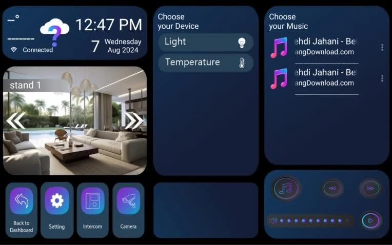

# Griffine_master
This application is designed for the Griffin smart system and is fully compatible with the smart devices produced by this company.
For more information, visit: https://griffin-bms.com/

The application operates using the UDP and TCP protocols for local communication and SMS for remote control.
In future updates, cloud and internet-based functionalities will also be added.

